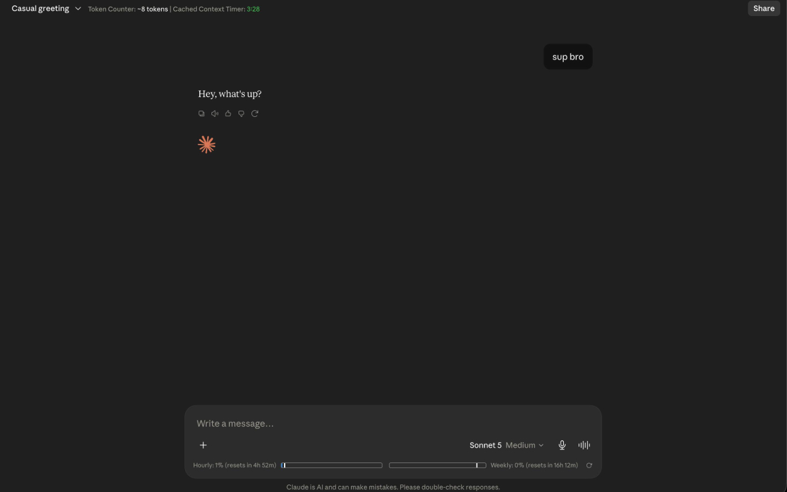

<p align="center">
  
</p>

<h1 align="center">Claude Token Counter</h1>

<p align="center"><b>A minimal browser extension that shows live token count, cache timer, and usage bars on claude.ai, exports any conversation to Markdown or plain text, and puts your plan limits one click away from any tab</b></p>

<p align="center">
  <a href="https://chromewebstore.google.com/detail/claude-token-counter/bioobpobpbeohjoefndgkiaakboimpch">
    
  </a>
  <a href="https://addons.mozilla.org/en-US/firefox/addon/claude-token-counter">
    
  </a>
</p>



## Features

- **Token count**: approximate token count for the current conversation
- **Cache timer**: countdown showing how long the conversation remains cached (cheaper to continue). It appears only while the context is actually cached and disappears when the window closes
- **Usage bars**: session (5 hour) and weekly (7 day) usage from Claude's native API, with reset countdowns and more precision than the rounded `/usage` page. Bars turn amber past 75% and red past 90%. A thin line marks how far through the window you are, so you can see whether you are burning quota faster than the clock
- **Chat export**: download the current conversation as Markdown or plain text, including any files Claude generated
- **Toolbar popup**: click the extension icon from any tab for your plan's session and weekly limits, with settings for what appears on the page and a one-click bug report

The extension requests a single permission, `storage`, which carries no install-time warning. Access to claude.ai is optional and requested only if you press refresh in the popup.

## Installation

**Chromium** (Chrome, Edge, Brave, Opera, Vivaldi, Arc, and any other Chromium-based browser)
1. Install directly from the [Chrome Web Store](https://chromewebstore.google.com/detail/claude-token-counter/bioobpobpbeohjoefndgkiaakboimpch). Works out of the box on Chrome, Brave, Vivaldi, and Arc. On Edge, turn on **Allow extensions from other stores** under `edge://extensions` first. On Opera, click **Add to Opera** on the listing page.
2. Or install locally: download the latest `claude-token-counter-chrome-*.zip` from the [Releases](../../releases) page, go to the browser's extensions page (`chrome://extensions` on Chrome, `edge://extensions` on Edge, `opera://extensions` on Opera, or the equivalent for your browser), enable **Developer mode**, and drag and drop the zip onto the page.

**Firefox** (requires Firefox 128 or later)
1. Install directly from [Firefox Browser Add-ons](https://addons.mozilla.org/en-US/firefox/addon/claude-token-counter).
2. Or download the latest `claude-token-counter-firefox-*.zip` from the [Releases](../../releases) page and drag it into any Firefox window, then click **Add**.

## How it works

The extension has two halves that run in two different JavaScript worlds, because claude.ai's own page scripts and network requests aren't visible to a normal content script.

**1. The injected bridge (`src/injected/bridge.js`)**

This script is injected directly into the page's own execution context (the "main world"), not the isolated content script sandbox. It patches three things on `window` before anything else on the page gets a chance to:

- `window.fetch`: every request claude.ai makes passes through here first. The bridge inspects the URL and response of each call:
  - POST requests to `/completion` or `/retry_completion` mark the start of a generation, which is used to show a "pending cache" state in the UI.
  - Responses with an `event-stream` content type are read via a `ReadableStream` reader, line by line, watching for a `data: {"type":"message_limit", ...}` payload. This is the same server-sent event stream Claude's own UI uses to update usage in real time, so the extension reads the exact same unrounded utilization numbers.
  - Responses to `/chat_conversations/{id}?tree=...` are cloned and parsed as JSON, giving the extension the full message tree for the active conversation.
- `history.pushState` / `history.replaceState`: claude.ai is a single-page app, so navigating between conversations doesn't reload the page or fire a `popstate` event. The bridge wraps both methods to dispatch a custom `cc:urlchange` event whenever the app changes routes, which is how the extension knows to re-attach its UI and refetch data for the new conversation.

Because the bridge runs in the page's own world, it can't call extension APIs like `chrome.runtime`, and the content script can't call anything the bridge defines. The only channel between them is `window.postMessage`, tagged with a `cc: 'ClaudeCounter'` marker and matched by request ID for request/response pairs (used for on-demand usage fetches and SHA-256 hashing) or broadcast as one-way events (used for the generation-start, conversation, and usage-limit signals above).

**2. The content script (`src/content/*.js`)**

Runs in the isolated content script world, declared in `manifest.json` against `https://claude.ai/*`. It's responsible for everything user-facing:

- `bridge-client.js` injects `bridge.js` (via `chrome.runtime.getURL` / `browser.runtime.getURL`, whichever exists) as a `<script src="...">` tag so it runs in the main world, then listens for its `postMessage` events.
- `main.js` orchestrates state: it tracks the current conversation ID (parsed from the URL path), the current org ID (read from the `lastActiveOrg` cookie), and reacts to the bridge's events by kicking off token recomputation or usage refreshes. A `MutationObserver`-based `waitForElement` helper waits for claude.ai's own DOM anchors — the chat input (`[data-testid="chat-input"]`) and the chat title (`[data-testid="chat-title-split"]`) — to appear before attaching UI, since the SPA re-renders on every navigation.
- `tokens.js` turns a raw conversation payload into a token count. claude.ai stores every edit and every branch of a conversation in one flat `chat_messages` array; the extension walks backward from `current_leaf_message_uuid` via each message's `parent_message_uuid` to reconstruct just the active branch (the "trunk"). It strips out non-text content (thinking blocks, images, documents), serializes `tool_use`/`tool_result` blocks deterministically, and feeds the resulting text through a vendored `o200k_base` tokenizer (`src/vendor/o200k_base.js`), the same token encoding Claude uses internally, for an approximate but consistent count. A per-message cache (keyed by message UUID plus a length+hash fingerprint, hashed via the bridge's `crypto.subtle.digest` call) avoids re-tokenizing messages that haven't changed.
- `ui.js` renders and updates the actual widgets: the token count in the chat header, the cache countdown (based on the last assistant message's timestamp plus a 5 minute cache window), the session/weekly usage bars, and the export button. The usage row is anchored to the composer card (see below) so it sits inside the input box on both the home and conversation layouts.
- `export.js` turns a conversation payload into a Markdown or plain text document. It reuses the same trunk reconstruction as `tokens.js`, so an export contains the conversation as it currently reads, not the edited-away branches. Files Claude generated (`create_file`, and the older `artifacts` tool) are embedded in full, with every later `str_replace` edit replayed onto them so the exported file matches the version that was actually used. Tool calls collapse into a one-line summary rather than pages of JSON, and thinking blocks are excluded. The download uses a blob URL and an `<a download>` click, so no `downloads` permission is needed.

- `src/popup/*` is the toolbar popup and the settings panel. It is a separate document and cannot read the content script's memory, so the content script mirrors each usage reading into `chrome.storage.local` and the popup renders that snapshot, timestamped. Pressing refresh asks for optional access to claude.ai and then reads `/api/organizations` and the usage endpoint directly, so the popup works on a fresh install without ever opening claude.ai in a tab.

**3. Usage bars specifically**

Usage numbers come from two sources that the extension reconciles:

- A REST call to `/api/organizations/{orgId}/usage`, fetched on demand through the bridge, which returns rounded `five_hour` and `seven_day` utilization percentages plus their reset timestamps.
- The live SSE `message_limit` event described above, which carries the same data as unrounded fractions, so it's more precise than what claude.ai's own `/usage` page displays.

A one-second interval (`tick()` in `main.js`) keeps the countdowns moving, triggers an automatic refresh right after either window rolls over, and does a once-an-hour safety refetch if neither the SSE stream nor a manual refresh has updated the numbers recently.

Not every plan reports both sources. On the free plan the REST endpoint returns `null` for every window, so the SSE event that accompanies a reply is the only source and usage is unknown until the first message of a session. The row says so rather than sitting blank, and once a reading arrives it is stored and shown again on later loads. A stored window whose reset has passed is dropped, since no active window exists until the next message; one that has not is still correct, because usage only advances when a message is sent, so it is a floor rather than a stale figure. A window with no current reading keeps its place marked with a dash instead of disappearing, so the row never collapses to a single bar.

Because the free plan's figures only ever arrive with a reply, they cannot reflect usage from another device until the next message is sent in that browser. Refresh in the popup cannot help there either, and says so instead of restamping an old reading as current. Paid plans read from the endpoint on every load, so they are always accurate across devices.

Each bar carries a thin line showing how far through its reset window the clock has travelled, which is what makes the fill readable: 40% used two hours into a five-hour window means something different from 40% used with ten minutes to go. Neither source states how long a window actually is, so its start is inferred by subtracting the nominal length from the reset time. That inference is checked rather than trusted — a window can never have meaningfully more time left than it is long, so a reading well above the nominal proves the figure wrong for that account and the line is withdrawn instead of pointing somewhere misleading. The margin matters: the reset time comes from Claude's clock and the comparison is against your browser's, so a window that has just opened reads as slightly over-long on any machine running a little behind. The bar, the percentage, and the countdown are unaffected.

The composer is located by `[data-cds="ChatComposer"]`, Claude's own design-system attribute, falling back to a `rounded-composer` class and then to shape: the nearest ancestor of the text input that is a flex column with a corner radius and a painted background. Claude ships more than one composer design and the class names differ between them.

Nothing here talks to any server other than claude.ai itself. There's no analytics, no telemetry, and no third-party network calls; all computation (tokenizing, hashing, caching) happens locally in the browser.

**What is stored.** Three keys in extension storage, all local to your browser and never transmitted:

| Key | Contents |
| --- | --- |
| `cc:usageSnapshot` | the last usage reading, your organisation id, plan name, and which Claude layout was detected |
| `cc:settings` | which on-page elements you have switched off |
| `cc:feedbackDraft` | an unsent bug report, cleared once you open the issue |

No conversation content is ever stored. Exports are written straight to a download and never uploaded.

**Boundaries.** The bridge accepts messages only from its own window and addresses its replies to the page's own origin rather than broadcasting them. Organisation and conversation ids are pattern-checked before they reach a URL, so a crafted message cannot make the extension fetch a different endpoint. No `eval`, no `new Function`, and no `innerHTML` anywhere in shipped code. `npm test` enforces all of this.

## Exporting a conversation

Click the download icon next to the token counter in the chat header and pick **Markdown (.md)** or **Plain text (.txt)**. The file is built in the browser and saved straight to your downloads; nothing is uploaded anywhere.

An export contains every message on the active branch, generated files in full, and one-line summaries of the tools Claude used. Alternate versions of edited messages, thinking blocks, and raw tool output are left out. Binary outputs such as `.xlsx` files live in Claude's sandbox rather than in the conversation, so they are referenced by name but cannot be embedded.

## The popup

Click the toolbar icon to see the 5-hour and weekly limits and when the reading was taken. It works from any tab, not just claude.ai, because it renders a stored snapshot rather than live data. The bars use the same amber and red thresholds as the ones on the page, so a limit looks equally urgent wherever you notice it.

The refresh button fetches current numbers. The first press asks for access to claude.ai; declining leaves everything else working. Nothing is requested at install time.

The gear beside it opens settings, with a switch for each thing the extension adds to claude.ai: the token counter, the cached context timer, the export button, and the hourly and weekly bars. Everything is on by default, changes apply to open tabs immediately, and the preferences live in extension storage.

The bug icon opens a feedback box. Describe the problem and it opens a prefilled issue on this repository for you to review and submit. It deliberately does not file the issue itself: that would mean shipping a GitHub token inside the extension, where anyone could extract it. The report carries your extension version, browser, plan, and which Claude layout you are on, and you see all of it before anything is sent.

## Development

There is no build step. Load the repository root as an unpacked extension and reload it after editing; content script changes need an extension reload, not just a page refresh.

```bash
npm ci --ignore-scripts   # ESLint only; the extension ships no runtime dependencies
npm test                  # nine suites
npm run lint
```

The suites run the real content scripts in Node against a small DOM shim, so they exercise shipped code rather than a copy: the token and cache header, the exporter, the popup, the settings switches, the usage bars' elapsed-time markers, the two usage payload shapes, packaging, and a set of security guards that fail on `eval`, `innerHTML`, widened permissions, an unpinned GitHub Action, or a dependency that could execute code at install time.

One of them guards against features disappearing rather than misbehaving, which is a failure the others cannot see. `inventory.test.js` asserts what the UI is *made of* — every element exists, is attached, and has a style rule — and compares the rendered tree against a committed snapshot at `test/snapshots/ui-structure.txt`. Removing something is still allowed; it just has to be a visible edit to a list or a snapshot rather than a silent omission. Regenerate the snapshot deliberately with `UPDATE_SNAPSHOT=1 npm test`, and read the diff before committing it.

Anchoring and visual layout are the one thing the suites cannot reach — the DOM
shim has no layout, so it can prove an element exists but never that it is
painted. `test/fixtures/composer.html` covers that by hand: serve the repo
(`python3 -m http.server 8777`) and open it to see a real `CounterUI` attach to
all three composer variants. It is not part of `npm test`; there is no browser
in CI.

The version appears in `manifest.json` and `package.json`. CI and the release workflow both refuse to proceed if they disagree.

## Releasing

Push a `v*.*.*` tag. The workflow runs the tests and lint, checks the tag against the manifest, builds the Chrome and Firefox artifacts, verifies nothing unwanted was packaged, and publishes them with a `SHA256SUMS.txt`. Every action is pinned to a commit SHA. See [SECURITY.md](SECURITY.md) for the dependency policy.

## Credits

- Forked from [she-llac/claude-counter](https://github.com/she-llac/claude-counter)
- Token counting via [gpt-tokenizer](https://github.com/niieani/gpt-tokenizer) (MIT)
- Inspired by [Claude Usage Tracker](https://github.com/lugia19/Claude-Usage-Extension) by lugia19
